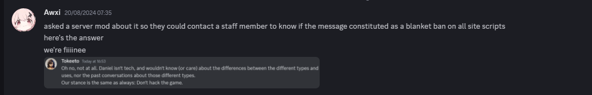
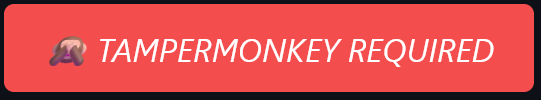

  
  

<h2>About Utilify</h2>

Utilify is a addon written in javascript that hopes to make features of KoGaMaBuddy as accessible as only possible to the general public. 
On top of porting KoGaMaBuddy's features it also adds countless new and never-seen before adjustments to boost your experience.

 

> [!NOTE]
> <h2>Utilify Contributors</h2>
> 

> I want to give <b>huge</b> thank you to everybody who has supported the project since it's beginning as well as helped finding bugs and solutions. 
> Not only that but so many people have provided me with ideas what to add and tweak for the best results. 
> </b>Seriously, thanks to each single one of you.  
> <i>I love you.</i> 
> <b> Awoi </b>, <b>Sorry</b>, <b>Raptor</b>, <b>Flavius</b>, <b>Tuna</b>, <b>Snowy</b>, <b>Idealism</b> and <b>Devorkk</b>  
> <i> All of you are wonderful</i>
  

  
> [!CAUTION]
> <h2>Read Before Using</h2>
> 

>  A lot of my friends have been banned and flagged for alleged cheating when using Utilify. 
> This should be considered a warning about usage of scripts and extensions for the website, no matter what they offer they can bring consequences.
> <b>STAY SAFE</b> 
>   
> 

>  I do not have an actual permission to use this screenshot: If you are not comfortable with me using it please let me know.  
>  
>
>   

  

> [!IMPORTANT]  
> <h2> Features & Installation</h2>
> 
> Please remember to stay safe and absolutely never try scripts that you don't understand or don't know origin of. 
> The only <b>safe place</b> to actually get Utilify from is only <a href="https://github.com/unreallain/Utilify/">this github respository</a>. 
> Due previously mentioned issue Utilify is only available on github. 
> Never trust optional sources if you value your privacy. 
>   
>  
